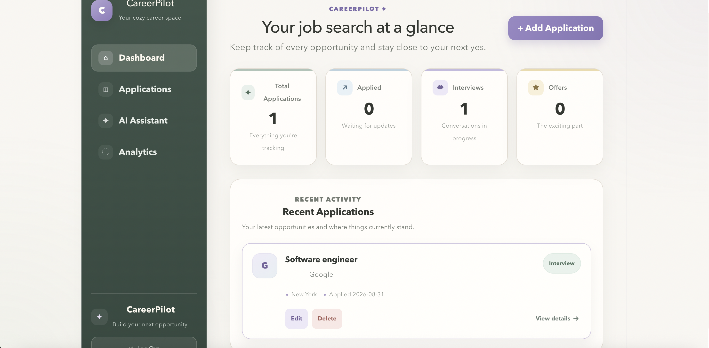
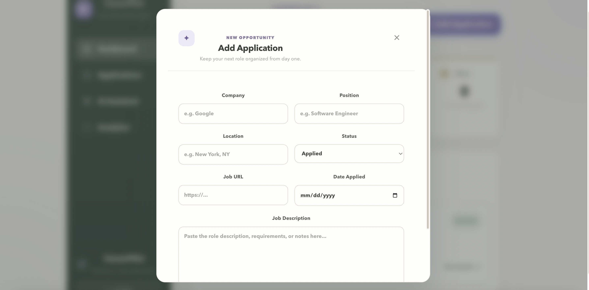
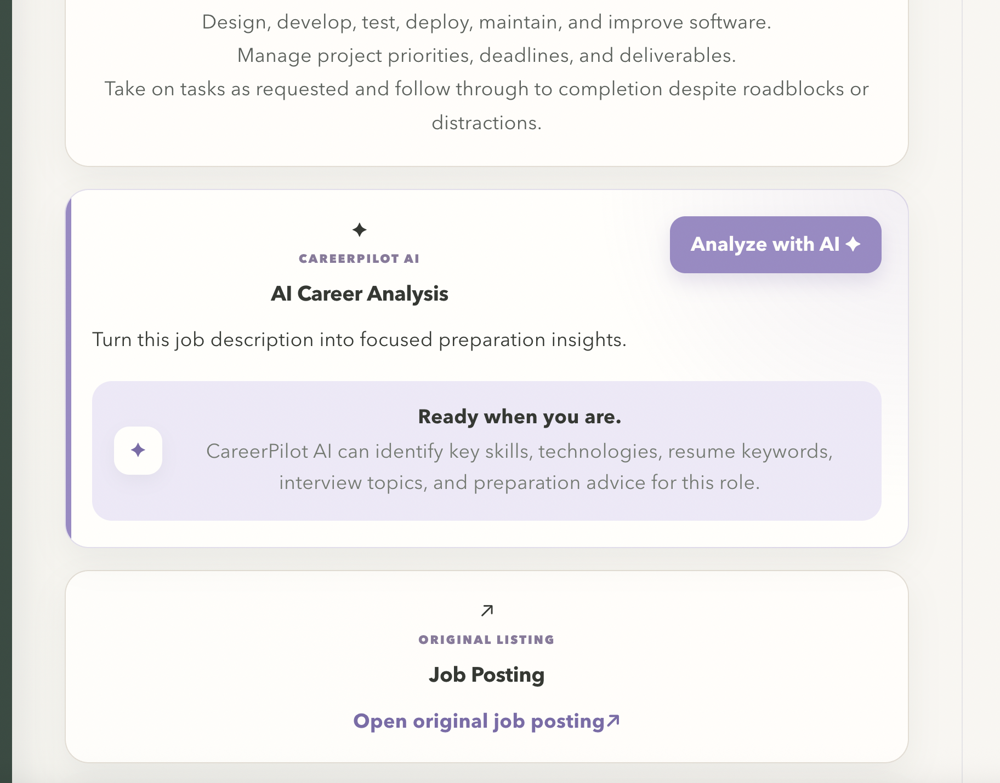
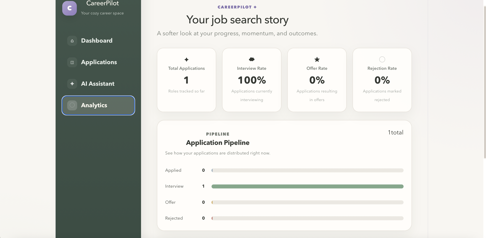
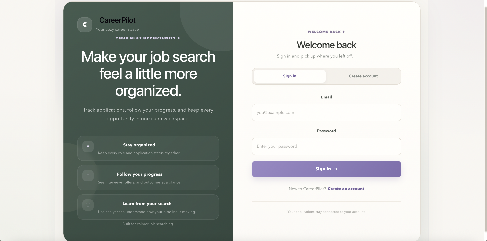

# CareerPilot

CareerPilot is a full-stack, AI-powered job application tracking platform designed to help job seekers organize applications, monitor progress, analyze their job search, and prepare more effectively for interviews.

The application combines a React and TypeScript frontend with a Java Spring Boot REST API, PostgreSQL persistence, JWT-based authentication, and OpenAI-powered job description analysis.

---

## Application Preview

### Dashboard



### Application Management



### AI Career Assistant



### Analytics



### Authentication



---

## Features

### Job Application Management

- Create, view, edit, and delete job applications
- Track company, position, location, status, date applied, job description, and job posting URL
- Search and filter applications
- View detailed information for each opportunity
- Track application progress from Applied → Interview → Offer
- Record rejected applications separately

### Application Status History

CareerPilot automatically records status changes for each application.

Users can view a chronological history showing how an opportunity has moved through the hiring process.

Status history is persisted in PostgreSQL and retrieved through the backend REST API.

### Analytics Dashboard

CareerPilot provides job-search analytics including:

- Total applications
- Applications by status
- Interview rate
- Offer rate
- Pipeline overview

This gives users a quick view of how their job search is progressing.

### AI Career Assistant

CareerPilot integrates with the OpenAI API to analyze saved job descriptions.

For an authenticated user's application, the AI assistant can identify:

- Key skills
- Technologies and tools
- Resume keywords
- Interview topics
- Preparation priorities
- Practical preparation recommendations

AI responses are rendered as formatted Markdown for a cleaner and more readable experience.

The AI endpoint also verifies application ownership before sending application data for analysis.

---

## Authentication & Authorization

CareerPilot includes a complete authentication flow using Spring Security and JWT.

Users can:

- Register an account
- Log in securely
- Maintain an authenticated session
- Log out
- Access protected application endpoints

Passwords are hashed using BCrypt.

JWT bearer tokens are used to authenticate protected API requests.

Application queries are scoped to the authenticated user so users can only access applications that belong to their own account.

---

## Tech Stack

### Frontend

- React
- TypeScript
- Vite
- CSS
- React Markdown
- Fetch API

### Backend

- Java 21
- Spring Boot
- Spring Security
- Spring Data JPA
- Hibernate
- REST APIs
- Maven

### Database

- PostgreSQL

### AI

- OpenAI API
- OpenAI Java SDK
- Responses API

### Authentication

- JWT
- BCrypt
- Spring Security

### Testing & Infrastructure

- JUnit
- Mockito
- Spring Boot Test
- Vitest
- React Testing Library
- Docker
- Docker Compose

---

## Architecture

```text
┌───────────────────────────────┐
│      React + TypeScript       │
│                               │
│ Dashboard                     │
│ Applications                  │
│ Application Details           │
│ Analytics                     │
│ AI Assistant                  │
└───────────────┬───────────────┘
                │
                │ HTTP / JSON
                │ JWT Bearer Token
                ▼
┌───────────────────────────────┐
│       Spring Boot REST API    │
│                               │
│ Controllers                   │
│ Services                      │
│ Spring Security               │
│ JWT Authentication Filter     │
│ Spring Data JPA               │
└───────────┬───────────┬───────┘
            │           │
            │           │
            ▼           ▼
┌──────────────────┐   ┌──────────────────┐
│    PostgreSQL    │   │    OpenAI API    │
│                  │   │                  │
│ Users            │   │ Job Description  │
│ Applications     │   │ Analysis         │
│ Status History   │   │                  │
└──────────────────┘   └──────────────────┘
```

---

## Backend Architecture

CareerPilot follows a layered backend architecture:

```text
Controller
    ↓
Service
    ↓
Repository
    ↓
PostgreSQL
```

### Controller Layer

Handles HTTP requests and responses.

### Service Layer

Contains application business logic and user-ownership checks.

### Repository Layer

Uses Spring Data JPA to communicate with PostgreSQL.

### Security Layer

Spring Security and a JWT authentication filter protect authenticated routes and establish the current user identity.

---

## AI Request Flow

CareerPilot's AI integration is intentionally connected to authenticated application data rather than accepting an arbitrary job description directly from the frontend.

```text
User selects application
        ↓
React sends authenticated request
        ↓
POST /api/ai/applications/{id}/analyze
        ↓
Spring Security validates JWT
        ↓
Backend identifies authenticated user
        ↓
Application ownership is verified
        ↓
Saved job description is loaded
        ↓
OpenAI Responses API
        ↓
Career analysis returned
        ↓
React renders formatted AI response
```

This keeps authorization checks on the backend and ensures users can only request analysis for applications they own.

---

## Example API Endpoints

### Authentication

```http
POST /api/auth/register
POST /api/auth/login
```

### Applications

```http
GET    /api/applications
GET    /api/applications/{id}
POST   /api/applications
PUT    /api/applications/{id}
DELETE /api/applications/{id}
```

### Application History

```http
GET /api/applications/{id}/history
```

### AI Analysis

```http
POST /api/ai/applications/{id}/analyze
```

Protected endpoints require a valid JWT bearer token.

---

## AI Analysis Example

The AI assistant analyzes the job description saved with an application and returns role-specific guidance organized into sections such as:

```text
KEY SKILLS
- Backend development
- REST API design
- Object-oriented programming

TECHNOLOGIES
- Java
- Spring
- PostgreSQL

RESUME KEYWORDS
- REST APIs
- Backend development
- Database design

INTERVIEW TOPICS
- Java fundamentals
- API design
- SQL
- Data structures

PREPARATION ADVICE
- Review Java and object-oriented programming concepts
- Practice REST API design questions
- Review SQL queries and relational database concepts
```

AI-generated guidance is intended to support preparation and should be verified against the original job posting.

---

## Project Structure

```text
career-pilot/
│
├── backend/
│   ├── src/main/java/
│   │   └── com/careerpilot/backend/
│   │       ├── ai/
│   │       ├── controller/
│   │       ├── dto/
│   │       ├── model/
│   │       ├── repository/
│   │       ├── security/
│   │       └── service/
│   │
│   └── pom.xml
│
├── frontend/
│   ├── src/
│   │   ├── api/
│   │   ├── components/
│   │   ├── pages/
│   │   ├── types/
│   │   ├── App.tsx
│   │   └── App.css
│   │
│   └── package.json
│
├── screenshots/
│   ├── careerpilot-login.png
│   ├── careerpilot-dashboard.png
│   ├── careerpilot-add-application.png
│   ├── careerpilot-ai.png
│   └── careerpilot-analytics.png
│
├── docker-compose.yml
├── .gitignore
└── README.md
```

---

## Running CareerPilot Locally

CareerPilot can be run either with Docker or by starting the frontend and backend manually.

### Option 1 — Docker

#### Prerequisites

- Docker
- Docker Compose
- OpenAI API key

Clone the repository:

```bash
git clone https://github.com/SorayaM0/career-pilot.git
cd career-pilot
```

Configure the required environment variables before starting the application.

Then start the containers:

```bash
docker compose up --build
```

To stop CareerPilot:

```bash
docker compose down
```

---

### Option 2 — Manual Setup

#### Prerequisites

Make sure you have installed:

- Java 21+
- Maven
- Node.js
- npm
- PostgreSQL

### 1. Clone the Repository

```bash
git clone https://github.com/SorayaM0/career-pilot.git
cd career-pilot
```

### 2. Configure PostgreSQL

Create a PostgreSQL database:

```text
career_pilot
```

Configure the database connection in the Spring Boot application configuration.

Do not commit database passwords or other secrets to Git.

### 3. Configure Environment Variables

CareerPilot requires environment variables for JWT authentication and AI functionality.

```bash
export JWT_SECRET="your-secret"
export OPENAI_API_KEY="your-openai-api-key"
```

### 4. Start the Backend

```bash
cd backend
mvn spring-boot:run
```

The backend runs at:

```text
http://localhost:8080
```

### 5. Start the Frontend

Open another terminal:

```bash
cd frontend
npm install
npm run dev
```

The frontend runs at:

```text
http://localhost:5173
```

---

## Testing

CareerPilot includes automated tests for both the backend and frontend.

### Backend

The backend test suite covers areas including:

- Authentication service behavior
- Job application business logic
- JWT generation and validation
- Application controller behavior
- Security and authorization
- AI controller behavior
- Spring application context

Run the backend tests with:

```bash
cd backend
mvn test
```

### Frontend

The frontend test suite uses Vitest and React Testing Library.

Run the frontend tests with:

```bash
cd frontend
npm test
```

The frontend production build can also be verified with:

```bash
npm run build
```

---

## Security

CareerPilot implements several backend security controls:

- BCrypt password hashing
- JWT authentication
- Protected REST endpoints
- Stateless Spring Security configuration
- User-scoped application queries
- Backend application ownership verification
- Authenticated AI analysis requests
- Secrets provided through environment variables rather than source code

The current frontend uses browser local storage for JWT persistence. For a production system, an HttpOnly secure-cookie authentication design would be worth evaluating to further reduce exposure of authentication tokens to client-side JavaScript.

---

## Project Status

CareerPilot's core functionality is complete.

- [x] Full application CRUD
- [x] PostgreSQL persistence
- [x] Application search and filtering
- [x] Application details
- [x] Status history
- [x] Application progress timeline
- [x] Analytics dashboard
- [x] User registration and login
- [x] BCrypt password hashing
- [x] JWT authentication
- [x] Protected REST APIs
- [x] Multi-user application ownership
- [x] AI job description analysis
- [x] Dedicated AI Assistant interface
- [x] Formatted AI responses
- [x] Automated backend tests
- [x] Automated frontend tests
- [x] Docker containerization
## Why I Built CareerPilot

Job searching involves more than keeping a list of applications. Candidates need to track opportunities, understand where they are in the hiring pipeline, identify patterns in their search, and prepare differently for each role.

CareerPilot brings those workflows into one full-stack application while also serving as a practical exploration of backend architecture, authentication and authorization, relational data modeling, REST API design, frontend state management, automated testing, containerization, and AI API integration.

---

## Author

Built by Soraya M.
